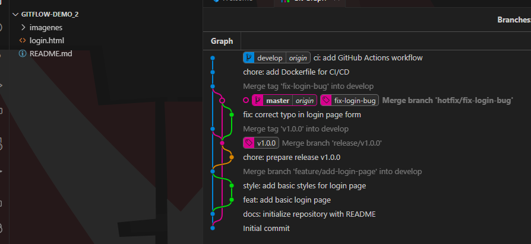

# GitFlow Demo

Este repositorio muestra un caso práctico completo de GitFlow, desde la creación del repositorio hasta la implementación de un flujo automatizado con GitHub Actions. Los participantes podrán seguir los pasos copiando y pegando los comandos en su terminal para aprender y practicar.


---

## **Requisitos Previos**
1. Tener instalado `git` y `git-flow`:
   - **Ubuntu/Debian**: `sudo apt install git git-flow`
   - **MacOS**: `brew install git-flow`
2. Tener una cuenta en [GitHub](https://github.com/).
3. Un editor de texto como Visual Studio Code o cualquier IDE de tu preferencia.
4. Tener Docker instalado y configurado en tu máquina local.

---

## **1. Configuración Inicial**

### Clonar el repositorio
Clona este repositorio en tu máquina local:
```bash
git clone https://github.com/<tu_usuario>/gitflow-demo.git
cd gitflow-demo
```

### Inicializar GitFlow
Inicializa GitFlow en el repositorio:
```bash
git flow init
```
Acepta las configuraciones predeterminadas:
- **master**: Producción.
- **develop**: Desarrollo.

Crea un archivo inicial para el proyecto:
```bash
echo "# GitFlow Demo" > README.md
git add README.md
git commit -m "docs: initialize repository with README"
git push -u origin master
git push -u origin develop
```

---

## **2. Ciclo de Vida de un Cambio**

### **Ambiente: DEV**
#### Paso 1: Crear una rama `feature`
```bash
git flow feature start add-login-page
```

#### Paso 2: Crear el archivo `login.html`
En **Windows (cmd)**:
```cmd
echo ^<DOCTYPE html^> > login.html
echo ^<html^> >> login.html
echo ^<head^> >> login.html
echo    ^<title^>Login Page^</title^> >> login.html
echo ^</head^> >> login.html
echo ^<body^> >> login.html
echo    ^<h1^>Welcome to the Login Page^</h1^> >> login.html
echo    ^<form^> >> login.html
echo        ^<label for='username'^>Username:^</label^> >> login.html
echo        ^<input type='text' id='username' name='username'^>^<br^>^<br^> >> login.html
echo        ^<label for='password'^>Password:^</label^> >> login.html
echo        ^<input type='password' id='password' name='password'^>^<br^>^<br^> >> login.html
echo        ^<button type='submit'^>Login^</button^> >> login.html
echo    ^</form^> >> login.html
echo ^</body^> >> login.html
echo ^</html^> >> login.html
```

#### Paso 3: Agregar y confirmar cambios
```bash
git add login.html
git commit -m "feat: add basic login page"
```

#### Paso 4: Mejorar el diseño con estilos básicos
En **Windows (cmd)**:
```cmd
echo ^<style^> >> login.html
echo body { font-family: Arial, sans-serif; margin: 20px; } >> login.html
echo form { border: 1px solid #ccc; padding: 15px; width: 300px; } >> login.html
echo ^</style^> >> login.html

git add login.html
git commit -m "style: add basic styles for login page"
```

#### Paso 5: Finalizar la rama `feature`
```bash
git flow feature finish add-login-page
git push origin develop
```

---

### **Ambiente: QA**
1. Crea una rama `release` para preparar un lanzamiento:
   ```bash
   git flow release start v1.0.0
   ```

2. Realiza ajustes finales:
   ```bash
   echo "<footer>Version 1.0.0</footer>" >> login.html
   git add login.html
   git commit -m "chore: prepare release v1.0.0"
   ```

3. Finaliza la rama `release`:
   ```bash
   git flow release finish -m "Primera versión estable de la aplicación" v1.0.0
   git push origin master
   git push origin develop
   git push --tags
   ```

---

### **Ambiente: UAT**
1. Crea una rama `hotfix` para corregir errores:
   ```bash
   git flow hotfix start fix-login-bug
   ```

2. Realiza la corrección:
   ```bash
   echo "<!-- Fixed typo in form labels -->" >> login.html
   git add login.html
   git commit -m "fix: correct typo in login page form"
   ```

3. Finaliza la rama `hotfix`:
   ```bash
   git flow hotfix finish -m "Corrección de errores menores" fix-login-bug
   git push origin master
   git push origin develop
   git push --tags
   ```

---

## **3. Creación del Dockerfile**

1. Crea un archivo `Dockerfile` en la raíz del proyecto:
   ```bash
   echo "FROM python:3.9-slim" > Dockerfile
   echo "WORKDIR /app" >> Dockerfile
   echo "COPY login.html /app/" >> Dockerfile
   echo 'CMD ["echo", "Dockerfile ejecutado correctamente"]' >> Dockerfile
   ```

2. Agrega y confirma los cambios:
   ```bash
   git add Dockerfile
   git commit -m "chore: add Dockerfile for CI/CD"
   git push origin develop
   ```

---

## **4. Automatización con GitHub Actions**

1. Crea un archivo de flujo en `.github/workflows/ci.yml`:
   ```bash
   mkdir -p .github/workflows
   nano .github/workflows/ci.yml
   ```
   Pega el siguiente contenido:
   ```yaml
   name: CI/CD Pipeline

   on:
     push:
       branches:
         - develop

   jobs:
     build:
       runs-on: ubuntu-latest

       steps:
       - name: Checkout code
         uses: actions/checkout@v2

       - name: Set up Docker
         uses: docker/setup-buildx-action@v2

       - name: Build Docker image
         run: |
           docker build -t gitflow-demo:latest .

       - name: Run tests
         run: |
           echo 'No tests configured yet'
   ```

2. Agrega y confirma los cambios:
   ```bash
   git add .github/workflows/ci.yml
   git commit -m "ci: add GitHub Actions workflow"
   git push origin develop
   ```

---

## **5. Verificar el Flujo**
1. Revisa el historial de ramas (`feature`, `release`, `hotfix`).
2. Valida los pipelines en la pestaña **Actions** del repositorio en GitHub.

---

¡Sigue estos pasos y explora GitFlow! Si tienes preguntas, abre un issue en este repositorio.

Conectemos:

www.linkedin.com/in/miguelsancor
